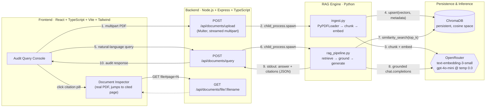

# Axiom — Financial Compliance RAG Engine

**An enterprise audit platform for automated regulatory and 10-K filing analysis — not a PDF chatbot.**

Axiom lets a compliance analyst upload a regulatory filing (10-K, 10-Q, internal audit report) and interrogate it in natural language, with every answer traceable back to an exact page and passage in the source document. It is built around a single non-negotiable constraint for anything touching financial disclosure: **the model is not allowed to know things the filing didn't say.**


---

## Why this exists

Generic "chat with your PDF" tools optimize for fluency. Financial compliance work has the opposite requirement: an answer that sounds confident but cites the wrong page, or worse, invents a number, is a liability, not a convenience. Axiom is designed for the audit trail, not the demo:

- Every retrieved chunk carries immutable `{ source, page, char_count }` metadata from the moment it's embedded — there is no de-anonymized text floating around without provenance.
- The generation step is pinned to `temperature=0.0` and constrained by a system prompt that treats the retrieved context as the *entire* universe of truth, with a deterministic refusal string when that universe is insufficient.
- The UI is built for an auditor's workflow: query on the left, the actual source PDF (jumped to the cited page) on the right — not a wall of chat bubbles.

---

## Architecture

Axiom is a **decoupled three-tier monorepo**. The frontend never talks to Python directly — it goes through a Node.js gateway that treats the RAG engine as a subprocess, not a service it's tightly coupled to.



**Request lifecycle, end to end:**

1. A filing is uploaded through the console; Express/Multer streams it to disk and immediately spawns `ingest.py` with the file path.
2. The engine loads the PDF page-by-page (`PyPDFLoader`), splits it with a 800-char / 100-char-overlap `RecursiveCharacterTextSplitter`, embeds each chunk (`text-embedding-3-small`), and upserts into a persistent, cosine-indexed ChromaDB collection with `{ source, page, char_count }` stamped onto every vector.
3. A query spawns `rag_pipeline.py`, which retrieves the top-k nearest chunks, formats them into a fenced context block, and sends a temperature-0.0 completion request constrained to answer *only* from that context.
4. The engine prints two fenced stdout blocks (`--- AXIOM AUDITED ANSWER ---` / `--- RETRIEVED SOURCES ---`); the Node layer parses stdout deterministically and returns clean JSON — no fragile inter-process protocol, no persistent RPC surface.
5. The frontend renders the answer with clickable citation pills. Clicking one pulls the **real PDF page** into the Document Inspector via a dedicated file-serving route (path-sanitized against traversal), jumped to the correct page fragment — so the analyst is looking at the actual filing, not a reconstruction of it.

---

## Core compliance features

| Feature | Implementation |
|---|---|
| **Strict source citations** | Every vector chunk is embedded with immutable `source` / `page` / `char_count` metadata at ingestion time. Citations returned to the UI carry the original excerpt text, not a paraphrase. |
| **Zero-hallucination guardrail** | Two layers: (1) if the retriever returns no chunks, the API short-circuits to a fixed string — no model call happens at all; (2) the system prompt binds the model to the retrieved context under `temperature=0.0` and instructs an exact refusal — `"Insufficient disclosure in provided filing."` — when that context doesn't support an answer. |
| **Dual-pane audit UI** | Left pane is a terminal-styled query console with streaming responses and metric tables. Right pane is a live Document Inspector that renders the actual source PDF and auto-navigates to the page a citation points to. |
| **Classified document handling** | Every ingested filing carries a `retentionClass` (`Public` / `Confidential` / `Restricted`) surfaced directly in the inspector chrome, alongside issuer, fiscal period, and checksum fields. |

---

## Technical highlights & trade-offs

Three deliberate architectural bets, and why they were made:

### 1. Decoupled Node.js gateway + Python engine, instead of a single FastAPI service

A pure-Python stack (FastAPI serving LangChain directly) is fewer moving parts, and was seriously considered. Axiom instead puts a Node/Express layer in front of a Python engine invoked via `child_process.spawn`, for three reasons:

- **The API gateway and the ML engine have different scaling shapes.** The gateway needs to hold open many concurrent, cheap HTTP connections; the engine's job is a single expensive call (embedding + generation) per request. Decoupling them means the gateway can be scaled, rate-limited, or replaced independently of whatever the retrieval engine ends up being — including a future migration to a hosted inference endpoint that isn't Python at all.
- **Multer's streaming upload handling is a better fit for large PDF ingestion than the multipart story in most Python web frameworks** — files are streamed to disk with size/type validation before the engine ever sees them, keeping memory-heavy PDF parsing out of the request-handling process.
- **Process isolation is a feature, not overhead, for this workload.** Each ingestion or query is a fresh, short-lived Python process — a crash in `langchain`'s dependency tree (a real risk, given how fast that ecosystem moves) takes down one request, not a shared long-lived interpreter serving every user.

The honest cost: stdout-parsing as an IPC mechanism (see `documentControllers.ts`) is a pragmatic choice for a single-engine deployment, not something that scales to a distributed job queue — that migration path (gRPC or a message queue in front of a proper worker pool) is the natural next step if Axiom needed to run at real production concurrency.

### 2. Local persistent ChromaDB instead of a managed vector database

Pinecone, Weaviate Cloud, or Qdrant Cloud would remove operational burden and add hosted scaling. Axiom uses `chromadb.PersistentClient` writing to local disk instead, because:

- **Data residency matters more than convenience for filings that may be marked `Confidential` or `Restricted`.** A local, persistent, cosine-indexed store means vectorized filing content never leaves the deployment boundary — a real requirement in regulated environments before a formal vendor risk review is done.
- **Zero external dependency for the retrieval hot path.** Query latency is embedding-API-bound, not vector-store-bound, and there's no additional network hop or third-party SLA in the critical path.
- The trade-off is real: no built-in horizontal sharding, no managed replication, no dashboard. For a single-tenant compliance desk this is the right call; for a multi-tenant SaaS version of Axiom, migrating the retrieval layer behind an interface (already isolated in `rag_pipeline.py`) to a managed store would be a contained change, not a rewrite.

### 3. Deterministic compliance prompting instead of open-ended generation

The system prompt doesn't ask the model to "be helpful" — it asks it to behave like a control function:

- `temperature=0.0` removes sampling variance from an already narrow decision (answer from context, or refuse).
- The refusal string is specified verbatim in the prompt and re-validated at the retrieval layer, so "insufficient disclosure" is enforceable in two independent places, not just a hopeful instruction to the model.
- This intentionally sacrifices the more natural, varied phrasing a higher-temperature assistant would produce. In a compliance workflow, reproducibility of an answer given the same filing is worth more than conversational polish.

---

## Repository structure

```
Axiom/
├── frontend/                      # React 19 + TypeScript + Vite + Tailwind CSS
│   ├── src/
│   │   ├── api/axiomApi.ts        # Typed fetch client for the Express gateway
│   │   ├── components/
│   │   │   ├── AuditDashboard.tsx     # Top-level layout, state, upload/query orchestration
│   │   │   ├── AuditConsole.tsx       # Left pane — query input, message stream, metrics
│   │   │   ├── DocumentInspector.tsx  # Right pane — live PDF viewer, jumps to cited page
│   │   │   ├── CitationChip.tsx       # Clickable source citation pill
│   │   │   ├── IngestionTicker.tsx    # Live ingestion pipeline status strip
│   │   │   └── MetricTable.tsx        # Structured metric rendering
│   │   └── types/audit.ts         # Shared domain types (Citation, DocumentMetadata, ...)
│   └── vite.config.ts
│
├── backend/                        # Node.js + Express + TypeScript API gateway
│   └── src/
│       ├── server.ts                       # Express app, CORS, route mounting
│       ├── routes/documentRoutes.ts        # Multer config, endpoint definitions
│       └── controllers/documentControllers.ts  # spawn() into the Python engine, response shaping
│
├── engine/                          # Python + LangChain + ChromaDB RAG engine
│   ├── ingest.py                    # PDF load → chunk → embed → upsert
│   ├── rag_pipeline.py              # retrieve → ground → generate → cite
│   ├── requirements.txt
│   └── chroma_db/                   # Persistent vector store (gitignored in production)
│
└── README.md
```

---

## Getting started

### Prerequisites

- Node.js 18+
- Python 3.11+
- An OpenRouter (or OpenAI) API key

### 1. Clone and install each tier

```bash
git clone <repo-url> axiom && cd axiom

cd backend && npm install
cd ../frontend && npm install
cd ../engine && pip install -r requirements.txt
```

### 2. Configure environment variables

**`engine/.env`** — credentials for embeddings and generation:

```env
OPENROUTER_API_KEY=sk-or-v1-...
OPENAI_API_BASE=https://openrouter.ai/api/v1
```

**`backend/.env`** — gateway configuration:

```env
PORT=5000
CLIENT_URL=http://localhost:5173
PYTHON_PATH=python
```

**`frontend/.env`** — points the SPA at the gateway:

```env
VITE_API_BASE_URL=http://localhost:5000
```

### 3. Run it

```bash
# Terminal 1
cd backend && npm run dev

# Terminal 2
cd frontend && npm run dev
```

Open `http://localhost:5173`. There is no separate process to start for the engine — the backend spawns `ingest.py` / `rag_pipeline.py` on demand.

### API surface

| Method | Route | Purpose |
|---|---|---|
| `GET` | `/health` | Liveness check |
| `POST` | `/api/documents/upload` | Multipart PDF upload → triggers ingestion |
| `POST` | `/api/documents/query` | `{ query: string }` → grounded, cited answer |
| `GET` | `/api/documents/file/:filename` | Streams the original PDF for the Document Inspector |

---

## Roadmap

Documented honestly, because a system that claims to have no gaps usually has one it isn't telling you about:

- **Pixel-precise citation highlighting** — citations currently resolve to a page, not a bounding box; a text-layer search pass (e.g. `pdfplumber`) would enable exact in-page highlighting.
- **Managed vector store adapter** — abstract `rag_pipeline.py`'s retrieval call behind an interface to support Pinecone/Qdrant for multi-tenant deployments.
- **Persistent audit log** — every query and its cited sources should be written to durable storage for after-the-fact compliance review, not just rendered client-side.
- **AuthN/RBAC** — retention-class-aware access control (`Public` / `Confidential` / `Restricted`) is modeled in the data layer today but not yet enforced at the API boundary.
